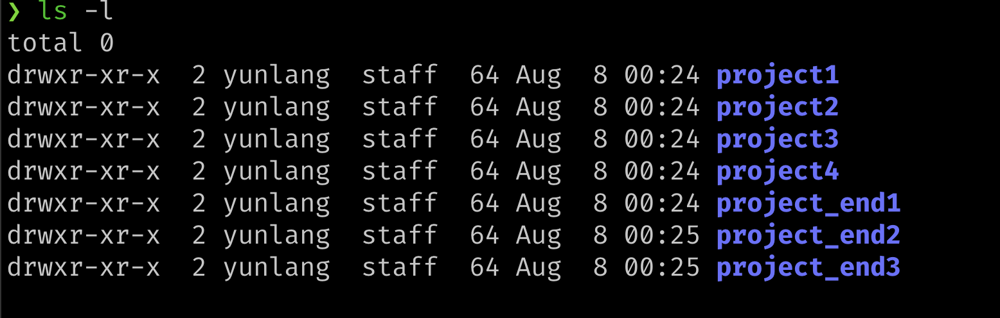

# 版本控制(Git)

你有没有遇到这样的情况， 你正在开发一个项目，昨天的代码运行的很好，但当你今天进行一次修改时，发现程序无法运行了。你想进行一次改动，但当改来改去，由于修改的地方太多，你甚至忘记了都改动了哪些部分。   

现在你想记录下每一次的改动了，于是出现了v0.1，v0.2，v0.3等各种版本，当你终于完成了工作时，你的工作树很有可能是这样。     
 
另一件悲伤的事情，你很可能忘记了都改动了什么。   

现在你要和朋友合作这个项目，为了让你的改动能在他的电脑上运行，他的改动能在你的电脑上运行。你需要进行项目的协同了，你能想到的几个办法可能是U盘又或者是QQ文件。但毫无疑问，无论哪种，你都需要将他做的部分放入你现在的项目里， 还要祈祷你们改动的文件没有交叉。当然，你们也会遭遇上面的麻烦。

利用版本控制工具可以帮助我们管理代码的修改历史；不仅如此，它还可以让协作编码
变得更方便。现代的版本协作系统可以回答以下的问题：

- 当前模块是谁编写的？
- 这个文件的这一行是什么时候被编辑的？是谁作出的修改？修改原因是什么呢？
- 最近的1000个版本中，何时/为什么导致了单元测试失败？

## 版本控制系统
目前常见的版本控制系统有集中式版本控制系统和分布式版本控制系统两种，你很难评价他们的优劣。集中式版本控制系统将内容存储在服务器上，用户想要使用需要先拉取到自己的计算机上进行修改，再将修改保存到服务器上。分布式版本控制系统则在每个人电脑中都保存了版本库内容。当服务器崩溃时，集中式会失去所有版本库数据，但对于分布式，只要一个人的电脑中留有备份，就获得了整个版本库的数据，能够很快从数据中恢复。

> 为了保证分布式版本控制系统中每个人的版本得到统一，分布式版本控制系统通常也会有一个中继用服务器。

两种版本控制系统的典型代表有[tortoisesvn](https://tortoisesvn.net)与[git](https://git-scm.com)  

我们主要讲述如何利用Git进行版本控制。

## 安装Git
你可以从[官网下载页](https://git-scm.com/download)下载Git的最新版本，我们将针对命令行工具进行讲解，掌握了命令行，GUI下的你也可以很快上手。   

我们将从工作中讲述Git的常见操作。

