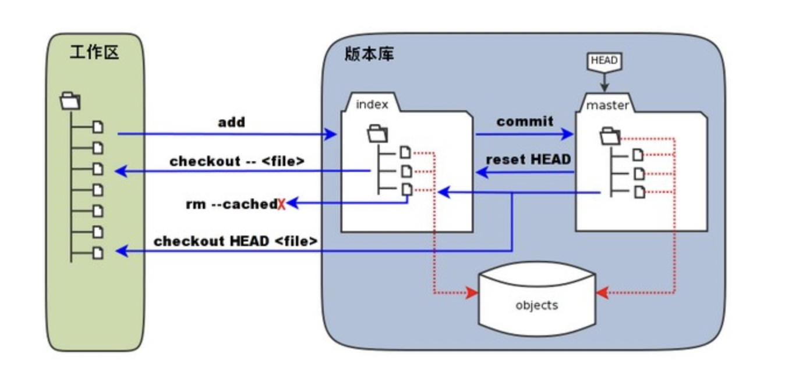
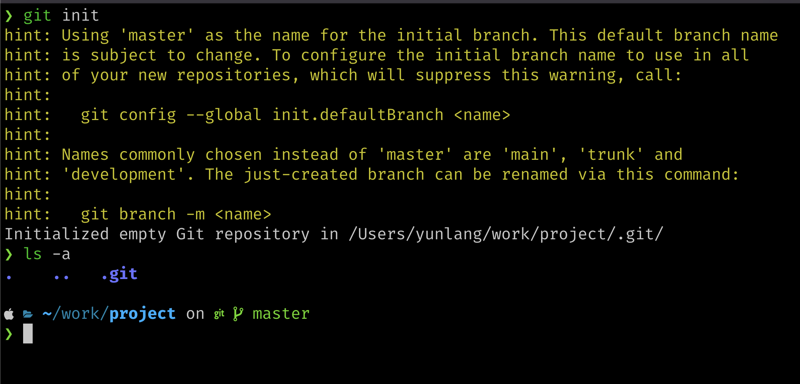
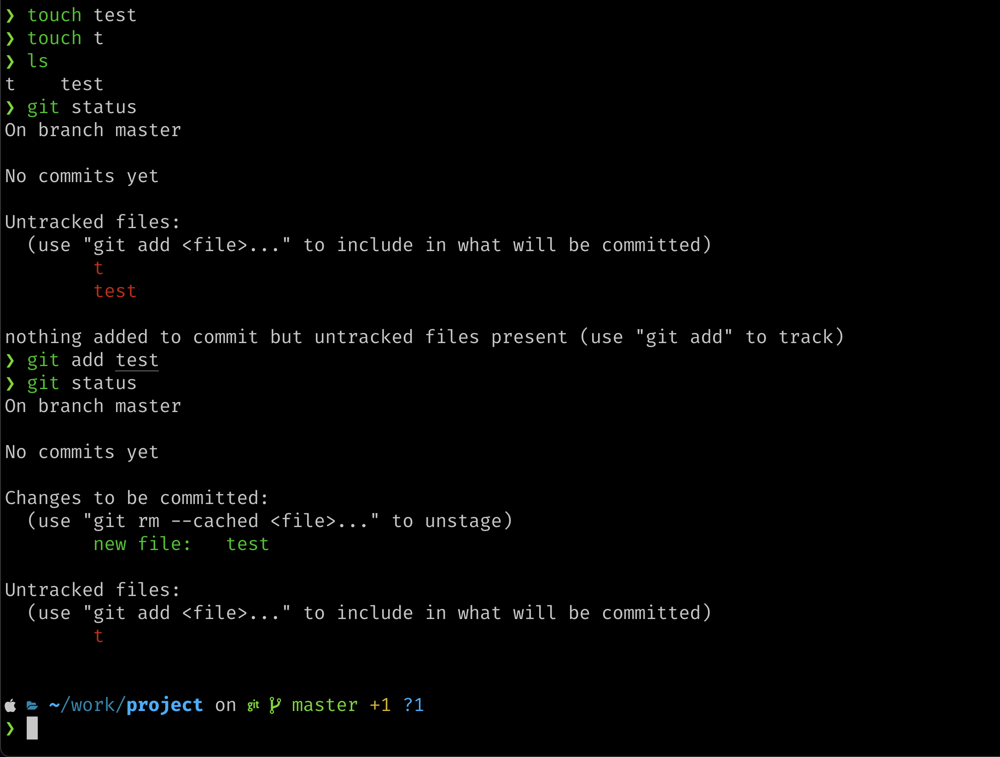
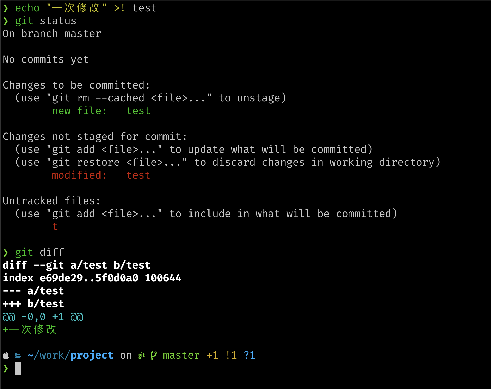
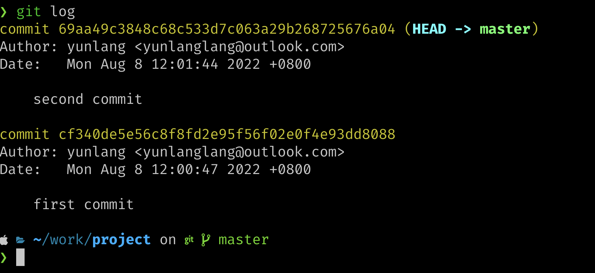

# 版本控制(Git)

你有没有遇到这样的情况， 你正在开发一个项目，昨天的代码运行的很好，但当你今天进行一次修改时，发现程序无法运行了。你想进行一次改动，但当改来改去，由于修改的地方太多，你甚至忘记了都改动了哪些部分。   

现在你想记录下每一次的改动了，于是出现了v0.1，v0.2，v0.3等各种版本，当你终于完成了工作时，你的工作树很有可能是这样。     
 
另一件悲伤的事情，你很可能忘记了都改动了什么。   

现在你要和朋友合作这个项目，为了让你的改动能在他的电脑上运行，他的改动能在你的电脑上运行。你需要进行项目的协同了，你能想到的几个办法可能是U盘又或者是QQ文件。但毫无疑问，无论哪种，你都需要将他做的部分放入你现在的项目里， 还要祈祷你们改动的文件没有交叉。当然，你们也会遭遇上面的麻烦。

利用版本控制工具可以帮助我们管理代码的修改历史；不仅如此，它还可以让协作编码 变得更方便。现代的版本协作系统可以回答以下的问题：
- 当前模块是谁编写的？
- 这个文件的这一行是什么时候被编辑的？是谁作出的修改？修改原因是什么呢？
- 最近的1000个版本中，何时/为什么导致了单元测试失败？

## 版本控制系统
目前常见的版本控制系统有集中式版本控制系统和分布式版本控制系统两种，你很难评价他们的优劣。集中式版本控制系统将内容存储在服务器上，用户想要使用需要先拉取到自己的计算机上进行修改，再将修改保存到服务器上。分布式版本控制系统则在每个人电脑中都保存了版本库内容。当服务器崩溃时，集中式会失去所有版本库数据，但对于分布式，只要一个人的电脑中留有备份，就获得了整个版本库的数据，能够很快从数据中恢复。

> 为了保证分布式版本控制系统中每个人的版本得到统一，分布式版本控制系统通常也会有一个中继用服务器。

两种版本控制系统的典型代表有[tortoisesvn](https://tortoisesvn.net)与[git](https://git-scm.com)  

我们主要讲述如何利用Git进行版本控制。

## 安装Git
你可以从[官网下载页](https://git-scm.com/download)下载Git的最新版本，我们将针对命令行工具进行讲解，掌握了命令行，GUI下的你也可以很快上手。   

我们将从工作中讲述Git的常见操作。

## Git操作
### Git 工作区、暂存区和版本库
我们首先要理解下Git工作区，暂存区和版本库的概念     

- 工作区：你在电脑里能看到的目录，即你直接操作的项目环境
- 暂存区：暂时存放当前的提交版本，但未真正保存到版本库记录中
- 版本库：真正记录了项目开发中的版本库数据

 

> 为什么要有暂存区？
> 通过暂存区的临时提交，可以有效保证最终提交时版本历史记录的完整性，确保commit的粒度，暂存区可以临时存储尚未完成的“半成品”代码。

### 新建仓库
为了使用Git，我们需要初始化一个Git仓库，在初始化Git仓库后，会在当前目录下生成一个 .git 目录，该目录会包含版本库的所有信息，工作区保持不变。

在当前目录初始化Git仓库
```bash
git init
```
   
可以看到我们的目录下多了一个.git目录（默认隐藏）

下面我们需要设置提交代码时的用户信息
```bash
git config --list #查看当前已经设置的内容
git config --global user.name "your name"
git config --global user.email "your email"
```
> `--global`参数会修改全部仓库下的信息，如果你只想修改当前仓库，可以去掉该参数

### 将修改保存到暂存区
添加修改并将修改保存到暂存区，可以使用```git add```命令，例如我们新建一个test文件，并将文件加入到暂存区。
```bash
touch test 
touch t         #新建文件
#git add .      #将当前目录下所有内容添加到暂存区
git add test    #将test文件添加到暂存区
```

利用```git status```，我们可以查看当前暂存区状态。

 

在未添加任何文件时，我们可以看到没有文件被跟踪，但当我们将test放入暂存区后，可以看到test已经被跟踪，但t仍然没有被跟踪。因此暂存区可以很方便的帮我们存储以单个文件为粒度的文件提交。

目前我们的test文件是空的，下面我们修改下test文件并查看```git status```输出，观察有什么变化。

```bash
echo "一次修改" >! test
git status
git diff
```

 

通过`git status`，当工作区与暂存区不同时，会提示我们发生了修改，而使用```git diff```能够直接反应变化情况（针对已跟踪文件）。
> ```git diff```指令不仅能用在工作区和暂存区的比较中，事实上很多Git命令在不同场合都有不同效果。

### 撤销修改
如果你认为工作区的修改出错，想要回到暂存区，可以使用```git checkout```命令完成撤销。
```bash
git checkout test 
git status
cat test
```
也可以利用```git rm --cached <file>```撤销添加到暂存区的文件。
```bash
git rm --cached test    #可以看作git add的逆过程
git status
```

### 将暂存区文件提交到本地仓库
使用```git commit ```命令可将暂存区文件提交到本地仓库，该命令会调用设置的编辑器以要求你添加提交信息，一种更方便的使用方式是```git commit -m "your message"```，你可以直接键入信息而非调用编辑器。
> ```git commit```默认使用vim作为编辑器，你也可以自己进行修改，比如我习惯使用neovim，我会通过```git config --global core.editor "nvim"```进行修改。

进行提交
```
git commit -m "first commit"
```
为了体现提交信息，我又将t文件加入到暂存区中进行了第二次提交，这样使用```git log```可以查看版本库的提交信息。
 
这样什么人什么时间进行了提交就一目了然了，你也可以通过每次提交的哈希值回退到任何一个提交版本。
